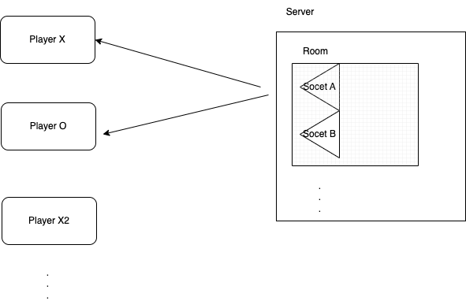

# \***\*Game of Three\*\***

This is a Node.js application that implements a game between two players who take turns modifying a randomly generated number, aiming to reach a number that is divisible by three. The game is played through a RESTful API and uses [Socket.IO](http://socket.io/) for real-time communication between players.

## **Architecture**

The application consists of a server component, which is responsible for managing the game state and handling incoming requests, and a client component, which runs in the player's terminals and handles real-time updates.

The server is built using Node js and uses Socket.IO to enable real-time communication between players. The client is built with Node js and uses the Socket.IO client library to communicate with the server.

The application uses TypeScript to enable static typing and improve code quality, and Jest for testing.



## **Libraries Used**

- Node.js: a JavaScript runtime that allows us to build server-side applications in JavaScript.
- Socket.IO: a library that enables real-time, bidirectional and event-based communication between the browser and the server.
- TypeScript: a superset of JavaScript that adds optional static typing and other features to improve code quality and maintainability.
- Jest: a popular testing framework for JavaScript applications that provides a simple and intuitive way to test code.
- Eslint: For linter, I used eslint for code consistency.

## **Installation**

To install the application, first clone the repository from GitHub:

```bash
git clone https://github.com/demoS11/game-of-three.git
```

Next, install the required dependencies:

```
cd game-of-tree
npm install
```

To start the server, run:

```
npm run start:server
```

This will start the server on **`http://localhost:3000`**.

To start the server, run:

```
npm run start:client
```

## **Improvements**

Some potential areas for improvement in this application include:

- Adding more error handling and input validation to ensure that the application is robust and secure.
- Implementing a better game logic that provides a more challenging and engaging experience for players.
- Adding a user interface that is more polished and visually appealing, to improve the overall user experience.
